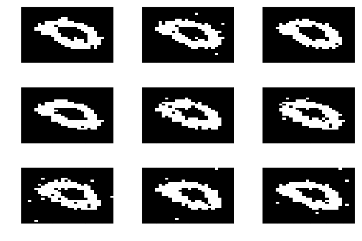

# Example: Generating images on MNIST dataset

MNIST is an image dataset consisting of handwritten digits. In this example, we will train RBMs on the distribution of "0"s using RBMAdvanced.jl. See [mnist_example.ipynb](mnist_example.ipynb) notebook to run this example by yourself.

## Import packages

First, import RBMAdvanced.jl package. Assuming you're running this on the repository root,

```julia
using Pkg
Pkg.activate(".")
Pkg.instantiate()
using RBMAdvanced
```

The following extra dependencies are required to run this tutorial. Please install them.

```julia
using MLDatasets: MNIST
using Plots

```

## Training dataset: MNIST 

First load the training dataset, and take a look how the samples looks like.

```julia
dataset =  MNIST()

X, y = dataset[:]

# Filter the data for label = 0
indices = findall(y .== 0)
X = X[:, :, indices]
y = y[indices]
X=transpose(Int.(round.(reshape(X[:,], (784, length(y))), digits=0)))
0
```


```julia
hms = [heatmap(reshape(X[i,:], (28,28)), color = [:black, :white], legend = false) for i in 1:9]
plot(hms..., layout = (3,3), colorbar = false, axis= false)
```


## Training by CD algorithm

Let's train our first RBM on MNIST. This is our first shot, but we're skipping naive training method; each image in MNIST has 28x28 = 784 pixels. Training this large dataset with naive method will take forever! So we start with CD. If you're not familiar what this means, check out our [tutorial](tutorial.md) first.

```julia
visibleSize = 784
hiddenSize = 300
weight = randInitRBMWeight(visibleSize, hiddenSize)

cdConfig = TrainingConfig(
    usePersistentChain=false,
    betas=[1.0],
    k=5,
    epochs=1000,
    learningRate=0.01
)
validateConfig(cdConfig)
trainRBM!(weight, X[1:30, :], cdConfig)
CDoutput = RBMAdvanced.inferRBM(weight, 1, 9, 100)
0
```

```julia
hms = [heatmap(reshape(CDoutput[i], (28,28)), color = [:black, :white], legend = false) for i in 1:9]
plot(hms..., layout = (3,3), colorbar = false, axis= false)
```



Great, the generated images do look like "0"s! Now we move on to more advanced training methods.

## Training by PCD algorithm

```julia
weight = randInitRBMWeight(visibleSize, hiddenSize)
pcdConfig = TrainingConfig(
    usePersistentChain=true,
    betas=[1.0],
    k=1,
    epochs=10000,
    learningRate=0.01
)
validateConfig(pcdConfig)
trainRBM!(weight, X[1:30, :], cdConfig)
PCDoutput = RBMAdvanced.inferRBM(weight, 1, 9, 100)
0
```

```julia
hms = [heatmap(reshape(PCDoutput[i], (28,28)), color = [:black, :white], legend = false) for i in 1:9]
plot(hms..., layout = (3,3), colorbar = false, axis= false)
```


## Training by PT algorithm

```julia
weight = randInitRBMWeight(visibleSize, hiddenSize)
ptConfig = TrainingConfig(
    usePersistentChain=true,
    betas=[1.0, 0.75, 0.5, 0.25, 0.0],
    k=5,
    epochs=10000,
    learningRate=0.001
)
validateConfig(ptConfig)
trainRBM!(weight, X[1:10, :], cdConfig)
PToutput = RBMAdvanced.inferRBM(weight, 1, 100, 100)
0
```

```julia
hms = [heatmap(reshape(PToutput[i], (28,28)), color = [:black, :white], legend = false) for i in 1:9]
plot(hms..., layout = (3,3), colorbar = false, axis= false)
```


