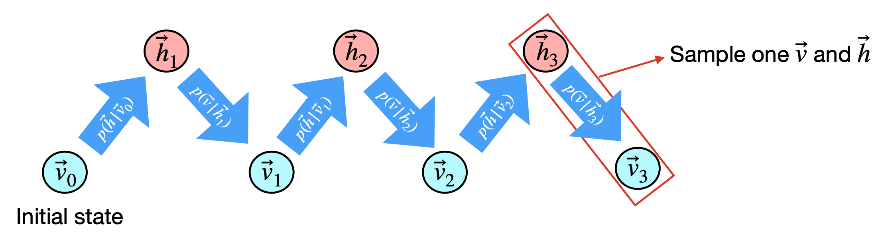
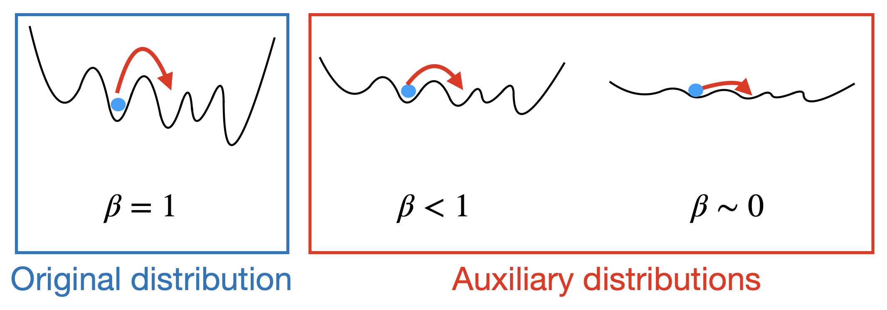

# RBMAdvanced.jl Tutorial

This document is a tutorial for RBM and its use in the RBMAdvanced.jl package. If you're already familiar with RBMs, feel free to skip ahead to the `Implementation: *` sections.

## What is RBM?

RBM (Restricted Boltzmann Machine) is a type of neural network that learns the probability distribution of given data. It was initially proposed by P. Smolensky in 1986. Unlike vanilla Boltzmann machines, which allow arbitrary connections, RBMs restrict the connections to only those between two layers: the visible and hidden layers. Connections between neurons within the same layer are not allowed. If you represent an RBM as a graph, it forms a structure similar to a dense (or linear) layer in a neural network.

But how does an RBM represent a probability distribution? For each state—where each neuron is assigned either 0 or 1—we define the energy of a state $S$ as:

$$E(S) = -\sum_{i \in V, j\in H} w_{ij} S_i S_j \, - \sum_{i \in V \cup H} b_i S_i$$

where $V$ and $H$ is the index set for visible and hidden neurons, respectively. This formulation is analogous to the spin glass model in physics, where the weights represent interactions between neighboring spins. Using matrix notation, this can be written as:

$$E(v, h) = -v^T W h - b_H \cdot h - b_V \cdot v$$

where $v, h$: visible, hidden state vectors, $b_*$: bias vectors, and $W$: weight matrix with shape $|V| \times |H|$

Now, we define the probability of each state $S$ proportional to $e^{-\beta E(S)}$ where $\beta$ is a hyperparameter that controls the smoothness of the distribution (inverse of temperature). Then, since the probability of all possible states must sum to 1, the probability of state $S$ is given as

$$q(S) = \frac{1}{Z} e^{-\beta E(S)}$$

where

$$Z=\sum_S e^{-\beta E(S)}$$

is the normalization factor. Since we are usually more interested in the distribution of the visible state, we compute the marginalized probability by summing over all hidden states.

$$q(v) = \sum_{h} q(v, h)$$

## Implementation: Naive Inference

Now that we know how to compute the probability distribution of an RBM, at least in theory, we can use the "naive inference" method implemented in RBMAdvanced.jl to test this.

```
using RBMAdvanced

visibleSize = 3
hiddenSize = 5
weight = randInitRBMWeight(visibleSize, hiddenSize)

println(inferRBM_naive(weight))
```

Example output:
```
Dict{Any, Any}([0, 1, 0] => 0.0028824897391779834, [1, 0, 1] => 0.027611608972332023, [1, 0, 0] => 0.002147013339664838, [0, 0, 1] => 0.0014878417722425205, [0, 0, 0] => 0.00016172793688411086, [1, 1, 1] => 0.8744774773571675, [1, 1, 0] => 0.05579950571941121, [0, 1, 1] => 0.035432335163119846)
```

This prints the probability distribution over the three visible binary variables (as defined by `visibleSize`), based on a randomly generated RBM weight matrix. You can modify the weight matrix as desired and run `inferRBM_naive` to observe how changes in the weights affect the probability distribution represented by the RBM.

However, this method quickly becomes computationally intractable. For example, try setting `visibleSize = 30` in the above code. Even on powerful computers, the program will take a very long time to run, as it must iterate over all possible $2^{35} \approx 3 \times 10^{10}$ combinations (0 or 1 for each of the `visibleSize + hiddenSize` neurons). Clearly, naive inference is not practical for large problems.

## Contrastive Divergence

MCMC (Markov chain Monte Carlo) is a powerful method for sampling from (possibly intractable) distribution. It is widely used in machine learning, and RBM is no exception. To sample from an RBM, we construct the Markov chain as follows:

$$h_{i+1} \sim p(h | v_{i}), v_{i+1} \sim p(v|h_{i+1})$$

Starting from a random $v_0$, we can obtain the chain of $\{v_i\}$, and samples from this chain follows the visible distribution $Q_V$ of the RBM.

To sample from $p(h|v_i)$, we can use Gibbs sampling. For each hidden neuron, assume all the other neurons are fixed, and compute energy by varying 0 and 1 for the chosen neuron. Then we can compute the probability distribution (Bernoulli) for the chosen neuron, and sample from it. Repeating the procedure for each hidden neuron, we obtain a sample for $h$. While this procedure may seem lengthy, it's equivalent to running a 'forward pass' of $v_i$, similar to a neural network. $\sigma({v_i}^T W + b_H)$ approximates $p(h|v_i)$ in Gibbs sampling, where $\sigma$ is sigmoid function. For sampling from $p(v|h_{i+1})$, we can use $\sigma(W{h_{i+1}} + b_V)$. 

## Implementation: Inference with CD Algorithm

The below example draws 100 samples using CD algorithm from an RBM with randomly generated weights. We sample after discarding the first 100 warmup samples to reduce dependence on initial sample.

```
using RBMAdvanced

visibleSize = 3
hiddenSize = 5
weight = randInitRBMWeight(visibleSize, hiddenSize)

println(inferRBM(weight, 1, 100, 100))
```

Example output:
```
Any[[1 1 0], [1 1 1], [1 1 1], [1 1 0], [1 1 1], [1 1 0], [1 1 0], [1 1 1], [1 1 1], [0 1 1], [1 1 1], [1 1 1], [1 1 1], [1 1 1], [1 1 1], [1 1 1], [1 1 1], [1 1 1], [0 1 1], [0 1 1], [0 1 0], [1 1 1], [1 1 1], [1 1 1], [1 0 0], [1 1 0], [1 0 1], [1 1 1], [0 1 1], [0 1 1], [1 0 1], [1 1 1], [1 1 1], [1 0 1], [1 1 1], [1 1 0], [1 1 1], [1 1 1], [1 1 1], [1 1 1], [1 1 1], [1 1 1], [1 1 1], [1 1 1], [1 1 1], [1 1 1], [1 1 0], [1 1 1], [0 1 1], [1 1 1], [1 1 1], [1 1 1], [1 1 1], [1 1 1], [1 1 1], [1 1 1], [1 1 1], [1 1 1], [1 1 1], [1 1 1], [1 1 1], [1 1 1], [1 1 1], [1 1 1], [1 1 1], [1 1 1], [1 1 1], [1 1 1], [0 1 1], [1 1 1], [1 1 1], [1 1 1], [1 1 1], [1 1 1], [1 1 1], [1 0 1], [1 1 1], [0 1 1], [1 1 1], [1 1 1], [1 1 1], [1 1 1], [1 1 1], [1 1 1], [1 0 1], [1 0 0], [1 1 1], [1 1 1], [0 1 1], [1 0 1], [1 1 1], [1 0 1], [1 1 0], [1 1 1], [1 1 0], [1 1 1], [0 1 1], [0 1 0], [1 0 1], [1 1 1]]
```

You may try scaling `visibleSize` to a large number and verify that CD can still return samples quickly where the naive method struggled.

## Training RBM with Contrastive Divergence

So far, we have explored methods to infer the probability distribution represented by an RBM given its weights. Now we demonstrate how to train an RBM to learn the probability distribution given a dataset.

RBM's training objective is to minimize KL divergence of its visible probability distribution with respect to the true distribution. So we should first compute the visible probability distribution first, to optimize the KL divergence. Writing $P_V$: true distribution and $Q_V$: visible probability distribution of the model, we can write the loss as

$$J=\mathbf{D}_\text{KL}(P_V || Q_V)$$

Then we have the same issue here - computing the exact probability distribution of RBM is too expensive. So we also use contrastive divergence for training the RBM as well.

Here is the procedure for training the RBM with contrastive divergence. Suppose we are given the dataset $\mathcal{D}$. Let $x \in \mathcal{D}$ be an element from dataset, represented as a $|V|$-dimensional vector. Then we run CD with $v_0 = x$ to sample $h_0 \sim P_\theta(h|v_0)$, $v_1 \sim P_\theta(v|h_0)$, $h_1 \sim P_\theta(h|v_1)$; this would look like a forward-backward-forward pass.



 Then, the gradients of $J$ with respect to RBM weights can be computed as below.

$$\frac{\partial J}{\partial b_V} = v_1 - v_0$$

$$\frac{\partial J}{\partial b_H} = h_1 - h_0$$

$$\frac{\partial J}{\partial W} = v_1 h_1^T - v_0 h_0^T$$

Now we run a optimization step using the gradients obtained above. In RBMAdvanced.jl, gradient descent on full dataset batch is used.

$$W \leftarrow W - \eta \frac{1}{|\mathcal{D}|}\sum_{x \in \mathcal{D}}\frac{\partial J}{\partial W}$$

Finally, we repeat the above steps for desired number of epochs.

## Implementation: Training with CD Algorithm

`train_RBM` method in RBMAdvanced.jl is designed to handle RBM training using CD and its variants. It accepts an initial RBM weight, dataset, and training config to train the RBM. Note that the RBM weight will be modified in-place.

Here's an example code to use `trainRBM!` method. We first define a simple toy dataset. Note that `dataset` has to be `|\mathcal{D}| \times |V|` matrix of batched dataset. Then we prepare a randomly initialized RBM weight. Also, we initialize the config, and call `validateConfig` to make sure the config is valid. This method will also print out the training method for debugging purposes. Finally we call `trainRBM!` to train the RBM. Then we use `inferRBM` to infer from the trained weight using CD.

```
using RBMAdvanced

dataset = [0 0 0; 0 0 1]

visibleSize = 3
hiddenSize = 5
weight = randInitRBMWeight(visibleSize, hiddenSize)

cdConfig = TrainingConfig(
	usePersistentChain=false,
	betas=[1.0],
	k=1,
	epochs=100,
	learningRate=0.1
)
validateConfig(cdConfig)

trainRBM!(weight, dataset, cdConfig)
println(inferRBM(weight, 1, 100, 100))

```

Example output:
```
Using CD
Any[[1 0 0], [0 0 1], [0 0 0], [0 1 0], [0 0 1], [0 0 0], [0 0 0], [0 0 0], [0 0 0], [0 0 1], [0 0 0], [0 0 1], [0 0 1], [0 0 1], [0 0 0], [0 0 1], [0 0 0], [1 0 0], [1 0 0], [0 0 0], [0 0 0], [0 0 1], [0 0 0], [0 1 1], [0 0 0], [0 0 0], [0 0 0], [0 0 0], [0 0 0], [0 0 0], [0 0 1], [0 1 0], [0 0 1], [0 0 1], [0 0 1], [0 0 0], [0 0 1], [0 0 1], [0 0 1], [0 0 0], [0 0 1], [0 0 0], [0 0 1], [0 0 1], [0 0 1], [0 0 0], [0 0 1], [0 0 1], [0 0 1], [0 0 0], [0 0 0], [0 0 1], [0 0 1], [0 0 0], [0 0 1], [0 0 0], [0 0 1], [0 0 1], [0 0 1], [0 0 1], [0 0 1], [0 0 1], [0 0 1], [0 0 0], [0 0 0], [0 0 1], [0 0 0], [0 0 1], [0 0 1], [0 0 1], [0 0 0], [0 0 1], [0 0 1], [0 0 1], [0 0 0], [0 1 1], [0 1 0], [0 0 0], [0 0 1], [0 0 0], [0 0 1], [0 0 1], [1 1 0], [1 0 0], [0 0 1], [0 0 1], [0 0 0], [0 0 0], [0 0 0], [0 0 1], [0 0 1], [0 0 1], [0 0 0], [0 0 0], [1 0 0], [0 0 0], [0 0 1], [0 0 0], [0 0 0], [0 0 1]]
```

Counting the example output, we have:
```
'[0 0 1]': 49, '[0 0 0]': 40, '[1 0 0]': 5, '[0 1 0]': 3, '[0 1 1]': 2, '[1 1 0]': 1
```
The output is slightly noisy, but it reflects the 50:50 mixture of `[0 0 1]` and `[0 0 0]` in the toy dataset.

## Overcoming the Pitfalls of CD

Although CD provides a fairly good approximation of RBM's probability distribution, it inherits the drawbacks of MCMC. MCMC can approximate the true distribution but only in asymptotic sense. So within finite runs, for glassy problems in particular, CD may produce heavily biased distribution that is concentrated around initial point. Parallel tempering (PT) is an advanced training method for dealing with this issue.

Before we explore PT, we should first look at PCD (persistent CD) which uses a persistent Markov chain for sampling. In contrast, vanilla CD starts a new chain for each training step, initializing $v_0=x$. By keeping the chain running, it could represent the true probability distribution of the RBM more accurately. However, it may still require extremely many steps for the chain to leave a local minima. What if we could smooth the landscape to make it easier for the chain to explore? Of course it would not be an exact approximation of the probability distribution of our interest, but at least we can hint our training algorithm to be aware of it.



Parallel tempering extends PCD to multiple Markov chains running in parallel. The chains are assigned different values of temperature (or different $\beta$); $\beta=1$ for the coldest chain that we are going to sample from for actual training, and we also keep hotter chains with smaller $\beta$ values. The idea is to use the hotter chains which smoother landscape to explore around, and randomly swap their states with the colder chains so that the exploration result is reflected.

PT is same as PCD except for the "exchange" step. After sampling is done for each chain, we first pick two neighboring chains $i$ and $i+1$ randomly. Then we compute the probability that the chains would be swapped, where the log-probability is computed from the energy of RBM given the sampled visible/hidden states.

$$P(\text{swap }i, i+1) = e^{(\beta_i - \beta_{i+1})(E_i - E_{i+1})} $$

Following this probability, we swap the states of chains $i$ and $i+1$. Gradients are computed from the updated states. The rest of the training procedure remains same as CD.

## Implementation: Training with PT Algorithm

Run the below code to train an RBM on the same toy dataset as seen in CD example, but this time using PT algorithm for training.

```
using RBMAdvanced

dataset = [0 0 0; 0 0 1]

visibleSize = 3
hiddenSize = 5
weight = randInitRBMWeight(visibleSize, hiddenSize)

cdConfig = TrainingConfig(
	usePersistentChain=true,
	betas=[1.0, 0.1, 0.01],  # use betas=[1.0] for PCD
	k=1,
	epochs=100,
	learningRate=0.1
)
validateConfig(cdConfig)

trainRBM!(weight, dataset, cdConfig)
println(inferRBM(weight, 1, 100, 100))
```

Note that this example code differs with CD training example by only two lines (for config) while uses the more complex training method under the hood; this demonstrates the convenience of config system of RBMAdvanced.jl that unifies RBM training methods.

## Next Steps

See [mnist_example.md](mnist_example.md) to see how to train RBMs on handwritten digit images using methods explained above.

## References

Desjardins, G., Courville, A., Bengio, Y., Vincent, P., & Delalleau, O. (2010, May). Parallel tempering for training of restricted Boltzmann machines. In Proceedings of the thirteenth international conference on artificial intelligence and statistics (pp. 145-152). Cambridge, MA: MIT Press.

Hinton, G. E. (2002). Training products of experts by minimizing contrastive divergence. Neural computation, 14(8), 1771-1800.

Smolensky, P. (1986). Information processing in dynamical systems: Foundations of harmony theory.

Tieleman, T. (2008, July). Training restricted Boltzmann machines using approximations to the likelihood gradient. In Proceedings of the 25th international conference on Machine learning (pp. 1064-1071).
